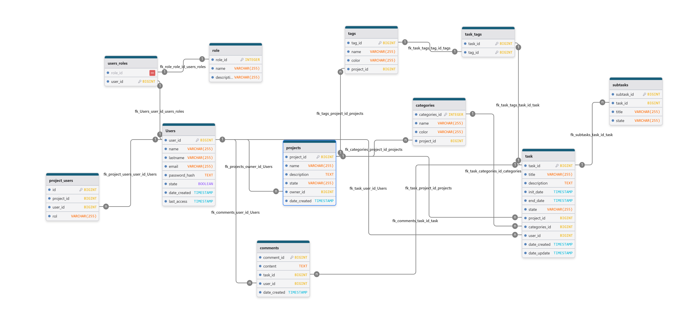

# TaskUES-DAW-GT02-2026

## Integrantes
* Josué Carlos Hernandez Chorro - HC21030
* Mario Ernesto Montoya Vasquez - MV16013
* Maria Ines Cruz Henriquez - CH20040
* Lidia Teresa Cruz Henriquez - CH20039
* Daniel Armando Herrera Amaya - HA13028

## Descripción del proyecto
TaskUES es una aplicación web diseñada para la gestión eficiente de tareas de manera individual y colaborativa. 
La aplicación tiene como objetivo facilitar la organización de actividades académicas y profesionales. 
La plataforma permitirá la creación de cuentas de usuario en el cual pueda tener uno o varios proyectos, 
donde pueda llevar la gestión de sus tareas con la facilitación de un apartado para comentarios que mejoren 
la productividad y el trabajo en equipo. Llevando el seguimiento de cada uno de los proyectos en un tablero Kanban 
ya que ofrecen una visualización clara del progreso de las actividades. 

## Tecnologías Utilizadas

### Backend
| Tecnología        | Descripción                              |
|-------------------|------------------------------------------|
| Java 17           | Lenguaje de programación                 |
| Spring Boot       | Framework para el desarrollo del backend |
| Spring Data JPA   | Persistencia de datos                    |
| PostgreSQL        | Sistema de gestión de base de datos      |
| Maven             | Gestión de dependencias                  |
| Lombok            | Reducción de código repetitivo           |
| Swagger / OpenAPI | Documentación de la API                  |
| Git y GitHub      | Control de versiones                     |
| IntelliJ IDEA     | Entorno de desarrollo                    |
| DBeaver           | Administración de la base de datos       |

## Diagrama Entidad Relación (DER)

## Documentación de la API

Una vez iniciado el backend, la documentación estará disponible en:

* Swagger UI: http://localhost:8080/swagger-ui.html
* OpenAPI Docs: http://localhost:8080/api-docs